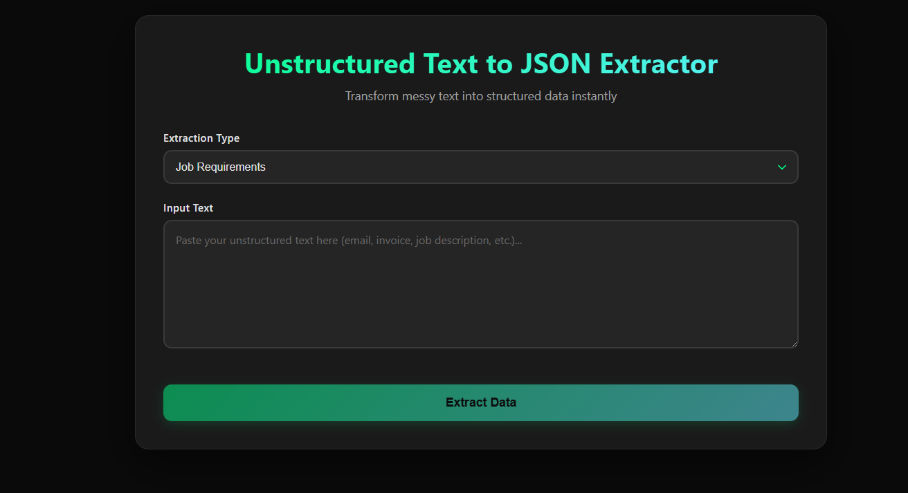
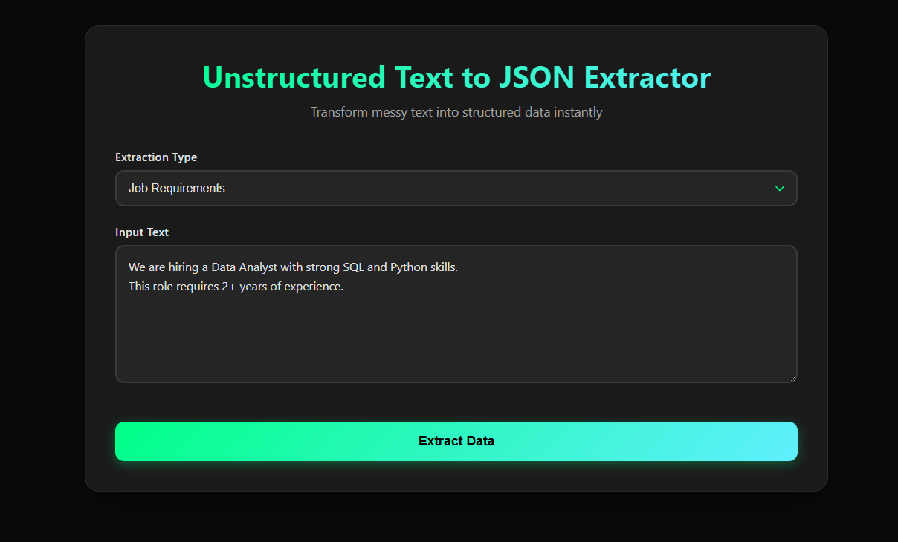
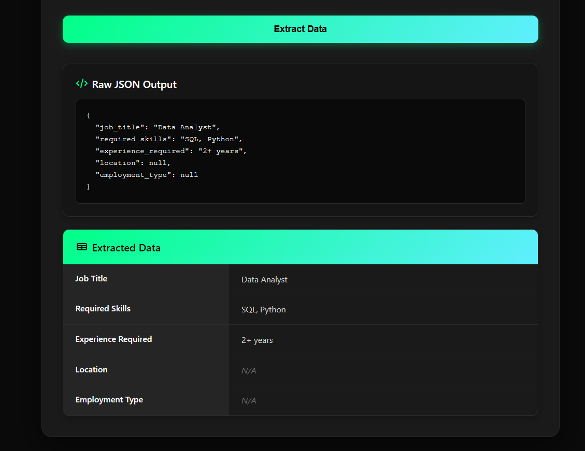
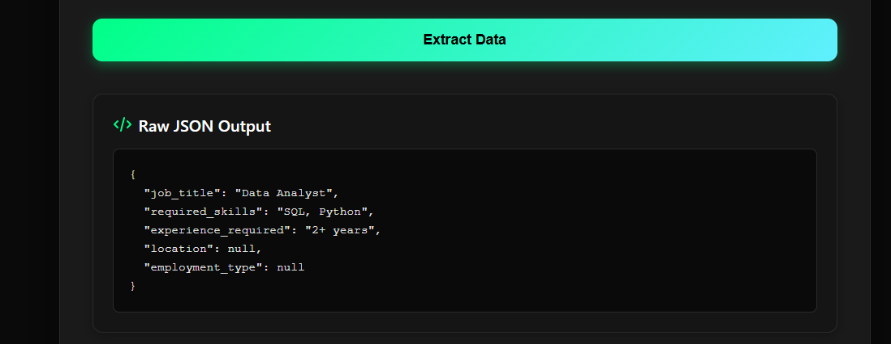

# Unstructured Text to JSON Extractor

A full-stack application that converts messy, unstructured text (emails, job descriptions, invoices, etc.) into strictly structured JSON output based on a predefined schema, using an LLM with strong validation and hallucination control.

## 📌 Problem Statement

Unstructured text is difficult to process programmatically. This project builds a system that:

- Accepts raw, unstructured text as input
- Allows users to choose an extraction schema
- Uses an LLM to extract only the required fields
- Returns clean, schema-compliant JSON
- Explicitly returns null for missing fields (no hallucination)

## 🚀 Features

- **Schema-driven extraction**
  - Contact Information
  - Job Requirements
  - Invoice Information
- **Strict JSON enforcement**
- **Hallucination prevention**
- **Automatic retry & normalization**
- **Keyword-style rendering for arrays**
- **Raw JSON + Table view**
- **Robust handling of long documents**
- **Frontend + Backend separation**

## 🏗️ Architecture Overview

```
Frontend (React + Vite)
         |
         |  HTTP (JSON)
         ↓
Backend (FastAPI)
         |
         |  Schema-driven prompt
         ↓
LLM (via OpenRouter - Claude)
         |
         |  Post-processing & validation
         ↓
Strict JSON Response
```

## 📸 Screenshots

### Main Interface

*The main application interface showing text input, schema selection, and extraction results*

### Text Input

*User interface for inputting unstructured text and selecting extraction schema*

### JSON Output View

*Clean JSON output showing extracted data with null values for missing fields*

### Raw JSON View

*Raw JSON response from the LLM with proper formatting and validation*


## 🧠 Key Design Decisions

### 1. Schema-First Design
Schemas are predefined in the backend. The LLM is never allowed to invent new fields.

### 2. Hallucination Prevention
- Missing fields are always returned as `null`
- Extra keys are ignored
- Output is merged strictly into the schema template

### 3. LLM Output Hardening
LLMs often return:
- Markdown blocks
- Explanatory text
- Invalid JSON

The backend:
- Extracts the first JSON block
- Normalizes quotes and formatting
- Retries once automatically if parsing fails

### 4. Deterministic Behavior
- Temperature set to 0.0
- Backend retries are hidden from the user
- User gets a valid response on first click

## 🛠️ Tech Stack

### Backend
- Python
- FastAPI
- Pydantic
- OpenRouter API (Claude model)

### Frontend
- React
- Vite
- JavaScript
- Fetch API

## 📂 Project Structure

```
unstructured-text-to-json/
├── backend/
│   ├── app/
│   │   ├── __pycache__/
│   │   ├── main.py
│   │   ├── routes.py
│   │   ├── schemas.py
│   │   ├── schema_store.py
│   │   ├── extractor.py
│   │   └── validator.py
│   ├── venv/
│   ├── .env
│   ├── README.MD
│   └── requirement.txt
│
├── frontend/
│   ├── public/
│   │   └── json.jpg
│   ├── src/
│   │   ├── assets/
│   │   ├── components/
│   │   │   ├── JsonView.jsx
│   │   │   ├── JsonView.css
│   │   │   ├── SchemaSelect.jsx
│   │   │   ├── SchemaSelect.css
│   │   │   ├── TableView.jsx
│   │   │   ├── TableView.css
│   │   │   ├── TextInput.jsx
│   │   │   └── TextInput.css
│   │   ├── services/
│   │   │   └── api.js
│   │   ├── App.jsx
│   │   ├── App.css
│   │   ├── main.jsx
│   │   └── index.css
│   ├── node_modules/
│   ├── .gitignore
│   ├── eslint.config.js
│   ├── index.html
│   ├── package.json
│   ├── package-lock.json
│   └── vite.config.js
│
├── .git/
├── .gitignore
└── README.md
│
└── README.md
```

## 📑 Supported Schemas

### 1. Contact Information
```json
{
  "full_name": null,
  "email": null,
  "phone_number": null,
  "organization": null,
  "location": null
}
```

### 2. Job Requirements
```json
{
  "job_title": null,
  "required_skills": null,
  "experience_required": null,
  "location": null,
  "employment_type": null
}
```

### 3. Invoice Information
```json
{
  "invoice_number": null,
  "invoice_date": null,
  "total_amount": null,
  "currency": null,
  "due_date": null,
  "vendor_name": null
}
```

## ▶️ How to Run Locally

### Backend
```bash
cd backend
python -m venv venv
venv\Scripts\activate   # Windows
pip install -r requirements.txt
uvicorn app.main:app
```

Create a `.env` file:
```
OPENROUTER_API_KEY=your_api_key_here
```

Backend runs on: `http://127.0.0.1:8000`

### Frontend
```bash
cd frontend
npm install
npm run dev
```

Frontend runs on: `http://localhost:5173`

## 🧪 Example Test Cases

### Job Description (with missing fields)

**Input:**
```
We are hiring a Data Analyst with strong SQL and Python skills. Requires 2+ years of experience.
```

**Output:**
```json
{
  "job_title": "Data Analyst",
  "required_skills": ["SQL", "Python"],
  "experience_required": "2+ years",
  "location": null,
  "employment_type": null
}
```

## 🛡️ Error Handling & Reliability

- Invalid JSON from LLM is normalized automatically
- Backend retries once internally
- User never sees raw LLM errors
- Browser CORS properly configured

## 📈 Production Considerations

- API keys stored securely in `.env`
- `node_modules` and sensitive files ignored via `.gitignore`
- Deterministic extraction behavior
- Easily extensible with new schemas


## 📌 Future Improvements

- Add more extraction schemas
- Export JSON / CSV
- Authentication & rate limiting
- UI enhancements (badges, collapsible sections)

## 👤 Author

**Siddhant Thapa**

This project was built as part of an internship assignment to demonstrate:
- Backend robustness
- LLM integration best practices
- Full-stack system design
- Production-ready engineering decisions
